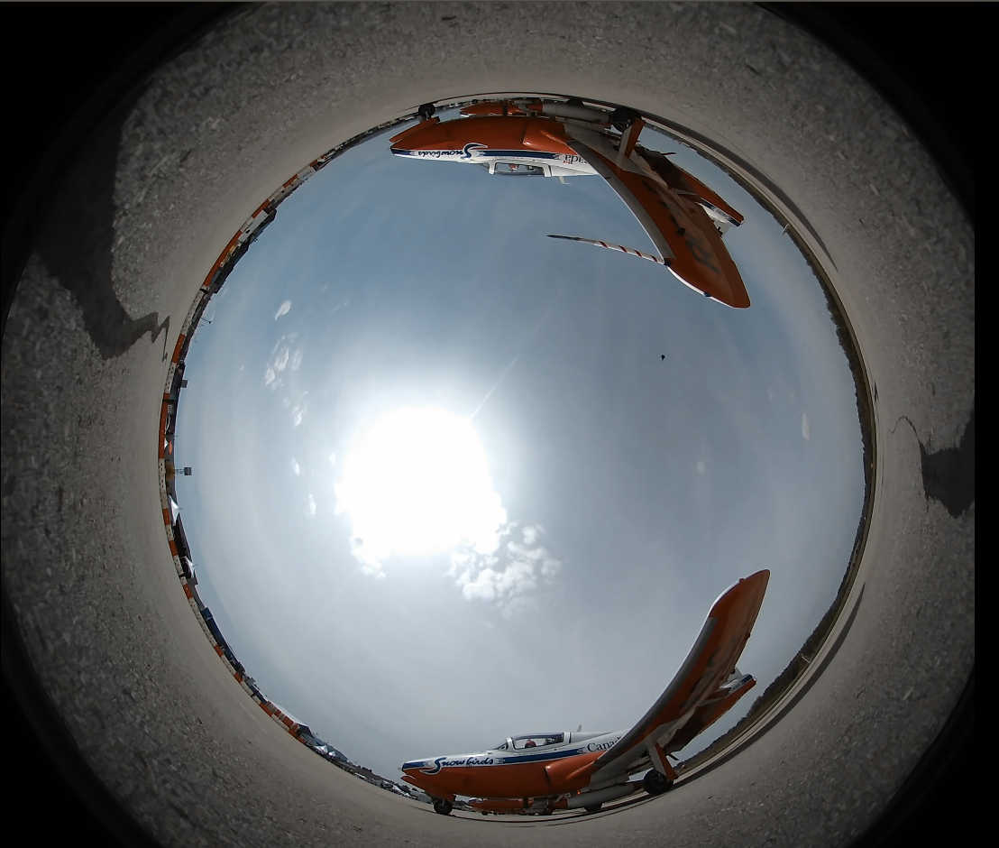

# videojs-panorama

A [VideoJS][videojs] and [MediaElement](https://github.com/mediaelement/mediaelement) plugin to run a full 180, 360 degree, 3d 360 degree panorama, fisheye and 3d fisheye video. Fully support VR device.

#### [DEMO HERE](http://yanwsh.github.io/videojs-panorama/)

# videojs-panorama v1.0.0 is coming soon
#### [DOWNLOAD HERE](https://github.com/yanwsh/videojs-panorama/releases/tag/v1.0.0-beta)

### Please help me test this new version. Keep in mind, this is beta version, so don't use it on production site.

## New Features
1. Support Media Element Player
2. Black screen detector
3. Keyboard control. (Left, Right, Up and Down arrow)
4. Hotspot support
5. Animation support
6. All in one (videojs 4, videojs 5 and media element player will detect automatically)
7. 180 video support
8. 360 Thumbnail support

## Usage

```javascript
var panorama = player.panorama({
            PanoramaThumbnail: true, //enable panorama thumbnail
            KeyboardControl: true,
            clickToToggle: true,
            Notice: {
                Enable: true,
                Message: (isMobile())? "please drag and drop the video" : "please use your mouse drag and drop the video"
            },
            Markers: [
                {
                    location: {
                        lat: 0,
                        lon: 180
                    },
                    radius: 500,
                    element: "This is text 1 with long text"
                },
                {
                    location: {
                        lat: 20,
                        lon: 160
                    },
                    radius: 500,
                    element: "This is text 2 with long text",
                    onShow: function(){
                        console.log("text 2 is shown");
                    },
                    onHide: function(){
                        console.log("text 2 is hidden");
                    }
                }
            ],
            Animation: [
                {
                    keyPoint: 0,
                    from: {
                        lon: 180,
                    },
                    to:{
                        lon: 540,
                    },
                    duration: 8000,
                    ease: "linear",
                    onComplete: function () {
                        console.log("animation 1 is completed");
                    }
                },
                {
                    keyPoint: 0,
                    from: {
                        fov: 75,
                    },
                    to:{
                        fov: 90,
                    },
                    duration: 5000,
                    ease: "linear",
                }
            ],
        });
```
#### Full documentation comming soon! If you have any question, feel free to post it on issues board.

## Table of Contents

<!-- START doctoc -->
<!-- END doctoc -->
## Installation

```sh
npm install --save videojs-panorama
```

or

```sh
bower install --save videojs-panorama
```

or

#### [DOWNLOAD HERE](https://github.com/yanwsh/videojs-panorama/releases)

## Integration with video.js 4 and 5

###1. If you don't have video.js, add its scripts and stylesheet to your page:

```html
<!-- video.js 4 -->
<link href="http://vjs.zencdn.net/4.12/video-js.css" rel="stylesheet">
<script src="http://vjs.zencdn.net/4.12/video.js"></script>
```
or

```html
<!-- video.js 5 -->
<link href="http://vjs.zencdn.net/5.8/video-js.css" rel="stylesheet">
<script src="http://vjs.zencdn.net/5.8/video.js"></script>
```

###2. Add three.js after video.js script
```html
<script src="https://cdnjs.cloudflare.com/ajax/libs/three.js/r76/three.js"></script>
```
###3. Add the plugin stylesheet and script

```html
<!-- Common -->
<link href="//path/to/videojs-panorama.min.css" rel="stylesheet">
```
and the videojs version-specific plugin, available in the **dist** folder
```html
<!-- video.js 4 -->
<script src="//path/to/videojs-panorama.v4.min.js"></script>
```
or
```html
<!-- video.js 5 -->
<script src="//path/to/videojs-panorama.v5.min.js"></script>
```
###4. Set up the video.js panorama plugin
```js
player.panorama({
    clickAndDrag: true,
    callback: function () {
      player.play();
    }
});
```

## Cross domain issue
In order to avoid a cross domain issue, please keep the code and video within same domain. videojs-panorama uses canvas and includes the video as a resource, so it should be at the same domain. For details, please see: [https://forums.developer.apple.com/thread/36725](https://forums.developer.apple.com/thread/36725)

If you really want to use a video hosted on a different domain, there are two solutions. 
(If you have alternatives, please let me know.)

## Video player in iframe
In order to avoid the cross-domain issue, we need to put the video player inside an iframe. However, mobile acceleration and fullscreen do not work in iframes, so you will have to set it up manually. Please check `iframe.html` and `iframe-video.html` for details, they include examples to allow mobile acceleration and fullscreen functionality to work in iframes. 

### Put it inside an iframe and use iframe in different domain. (Best solution)
### Experimental, only works in Chrome and Firefox; does not work in Safari!
Please make sure to add `crossorigin="anonymous"` attribute in video tag:
```js
        <video id="videojs-panorama-player" class="video-js vjs-default-skin" poster="assets/poster.jpg"  crossorigin="anonymous" controls>
            <source src="assets/shark.mp4" type='video/mp4'>
        </video>
```
On the server side, you have to set a cross-origin header, like `Access-Control-Allow-Origin: *`.

## Resize problem

Sometimes the video will need to be resized and/or go fullscreen. For performance, this plugin doesn't handle resize automatically. 
Here's the solution:
```js
var player = window.player = videojs('videojs-panorama-player', {}, function () {
    window.addEventListener("resize", function () {
        var canvas = player.getChild('Canvas');
        canvas.handleResize();
    });
});
```


## Fisheye video support

In some cases, you get the video like below. 



You don't have to use tools to convert video to equirectangular video, you can use this plugin to play directly.

There are two cases for fisheye video.
One case is the camera took from top to bottom. You may need to restrict user only view the bottom half of the sphere
```js
player.panorama({
    maxLat: -10,
    initLat: -10,
    rotateX: -Math.PI,
});
```

Another case is the camera took from bottom to top.
```js
player.panorama({
    minLat: 10,
    initLat: 10,
    rotateX: 0,
});
    
```

## Options

### clickAndDrag
By default, video will be rotated when user rollover their mouse. If clickAndDrag set to true, video rotation will only happen on user drag and drop the video. `Defaults to false`

### callback
callback function fired when panorama video is ready.

### showNotice
A notice label show on the beginning of the video to notice user to drag the player to see whole video. If showNotice set to false, notice label will not be shown. `Defaults to true`

### NoticeMessage
Customize your own notice message. 

### autoHideNotice
How long the notice message should be shown. `Defaults to 3000`, indicate it will hide after 3000ms.

### initLat
initial lat for camera angle, `Defaults value is 0`, range between -90 to 90.

### initLon
initial lot for camera angle, `Defaults value is -180`, don't have range. 

### backToVerticalCenter
automatically back to vertical center when user inactive the video frame. `Defaults value depends on running platform, true on desktop, false on mobile`.

### returnStepLat
If backToVerticalCenter is set to true, you can customize the return back speed. `Defaults value is 0.5`. The larger the faster.

### backToHorizonCenter
automatically back to horizontal center when user inactive the video frame. Default value the same as `backToVerticalCenter`.

### returnStepLon
If backToHorizonCenter is set to true, you can customize the return back speed. `Defaults value is 2`.

### clickToToggle
click to toggle the video. If video is playing, it will be paused. If video is paused, it will be played. `Defaults to false`.

It's possible to customize the viewable zoom
### minLat
minimum Lat value for camera angle. `Defaults value is -85`.

### maxLat
max Lat value for camera angle. `Defaults value is 85`.

### autoMobileOrientation
This feature only works on mobile device. Auto moving 360 video when user move their phone. `Defaults value is false`.

### videoType
This plugin can play two types of video, equirectangular and fisheye. `Defaults value is equirectangular`. 

## The properties below only support fisheye video.

### rotateX
rotate video view by x axis. `Defaults value is 0`. Value should be radian.

### rotateY
rotate video view by y axis. `Defaults value is 0`. Value should be radian.

### rotateZ
rotate video view by z axis. `Defaults value is 0`. Value should be radian.

## VREnable
whether VR button shows on control panel.  `Defaults value is true`.


## browser support
IE 11, Edge 12, 13, chrome, firefox, safari, iphone ios 9, ipad ios 9, android 4.4 and above.

## License

Apache-2.0. Copyright (c) yanwsh@gmail.com


[videojs]: http://videojs.com/
